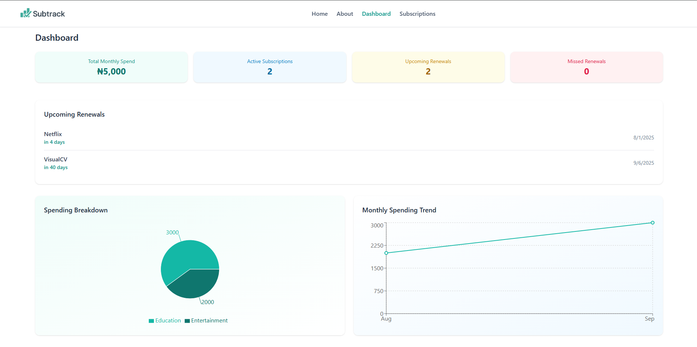
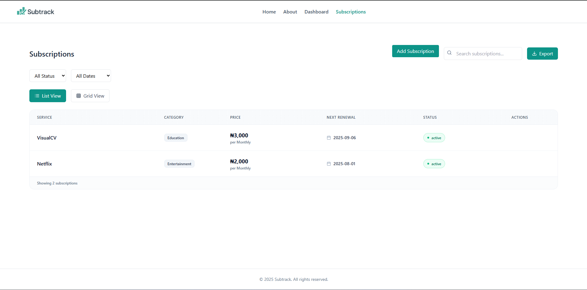
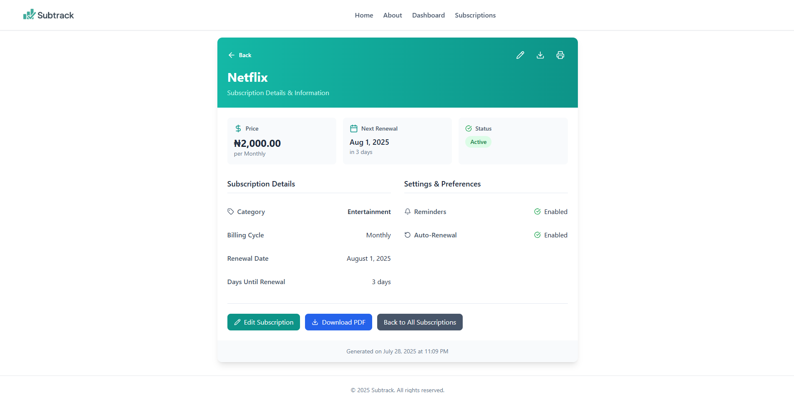

## 📦 SubTrack

**SubTrack** is a modern and intuitive subscription tracking app that helps users manage their recurring expenses effortlessly. With features like monthly overviews, filtering by status or date, and real-time visual insights, SubTrack is built to help users stay on top of their subscriptions.

---

### 🚀 Features

* 📋 Add and manage subscriptions with name, price, category, status, and renew date
* 🔄 View subscriptions in **list** or **grid** layout
* 🔍 Filter subscriptions by **status** (active, upcoming, missed) and **renewal date** (this month, next month)
* 🔎 Search subscriptions by name
* 📊 View total subscription cost and monthly trends (via line graph and pie chart)
* 💾 Data persistence using **localStorage**
* 💬 Toast notifications and validation feedback
* 📤 Export filtered subscriptions to CSV
* 🗑️ Edit or delete subscriptions with confirmation modals

---

### 📸 UI Screenshots

 
 


---

### 🛠️ Tech Stack

* **React + Vite** – frontend library
* **Tailwind CSS** – styling
* **Lucide React** – icons
* **Day.js** – date manipulation
* **React Context API** – state management
* **LocalStorage** – persistent storage

---

### 📁 Project Structure

```
src/
├── components/         # UI components like modals, views, graphs
├── context/            # SubscriptionsProvider using React Context
├── pages/              # Main Subscriptions page
├── utils/              # Optional: formatting utilities (e.g., currency, date)
└── App.jsx             # Routes and layout
```

---

### 🧪 How to Run Locally

1. **Clone the repository**

   ```bash
   git clone https://github.com/Dev-Rodiyat/SubTrack.git
   cd SubTrack
   ```

2. **Install dependencies**

   ```bash
   npm install
   ```

3. **Start the development server**

   ```bash
   npm run dev
   ```

---

### 🧠 Ideas for Future Improvements

* 🧑‍💼 User authentication (login/signup)
* ☁️ Cloud sync (e.g., Firebase or Supabase)
* 🗓️ Reminder notifications before renewals
* 📅 Calendar view of subscriptions
* 💳 Payment tracking & budgeting
* 📱 Mobile responsiveness improvements

---

### 📄 License

MIT License © 2025 \[Rodiyat Olajide]
